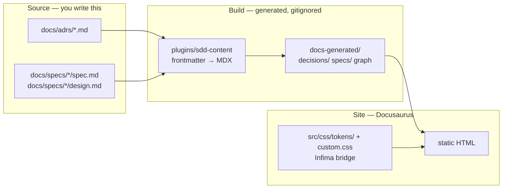

# Design: Documentation Site

## Context

[SPEC-0001](spec.md) describes what the site guarantees. This document describes how it is put together, and is the page to read before changing the plugin or the theme.

Three pieces, and the boundary between them is the thing to preserve:

The plugin never writes into `docs/`, and nothing in `docs/` knows the site exists. That is what keeps the markdown readable on the forge and in an editor.

## Goals / Non-Goals

### Goals

- Adoption is renaming four constants in `docusaurus.config.ts`.
- Artifact rendering is derived from frontmatter, never hand-maintained.
- One build, two hosts.
- The palette lives in exactly one place.

### Non-Goals

- Being a general-purpose Docusaurus starter. This is opinionated toward ADRs and specs.
- Versioned docs, search, or i18n. Docusaurus supports all three; the template does not configure them because most adopters do not need them and an unused config is a maintenance cost.
- Publishing the plugin as a package — explicitly deferred in [ADR-0002](/decisions/ADR-0002-vendored-plugin-over-published-package), with a stated trigger for revisiting.

## The content plugin

`docs-site/plugins/sdd-content/index.js` runs at build time and does five things:

1. **Builds the artifact graph** from frontmatter edge fields, deriving inverses.
2. **Builds ID→path mappings** so a bare `ADR-0006` in prose can become a link.
3. **Transforms each artifact** into MDX: escapes MDX-unsafe characters, highlights RFC 2119 keywords, colour-codes MADR consequence bullets, injects the metadata strip, and appends a mini-DAG.
4. **Generates index pages** for ADRs and specs, plus the project-wide graph page.
5. **Watches** the source directories, so hot reload works in `make docs-serve`.

### Two invariants worth stating

**`baseUrl` comes from `context.siteConfig`.** Docusaurus hands every plugin the fully-resolved config. The plugin must never re-derive it by reading `docusaurus.config.ts` off disk — that file assigns from a constant so CI can override the host, and a regex looking for a string literal finds nothing and silently yields `''`. Every cross-reference then points at the host root, which works locally (the dev server mounts at `baseUrl` anyway) and 404s in production.

**Filename matching is case-insensitive.** Projects disagree about `ADR-0001-x.md` versus `adr-0001-x.md`, and both are reasonable. Six separate regexes in this plugin match ADR filenames; all of them carry `/i`, and any new one must. A case-sensitive match does not fail loudly — it silently yields an empty mapping, no badges, and no graph nodes.

Both of these were real defects, found in August 2026. They are recorded here because the failure mode in each case was a *green build producing wrong output*, which is the class of bug this file exists to warn about.

## Theming

The design tokens are vendored verbatim into `docs-site/src/css/tokens/` from the Bubbletea TUI design system export. **They are not edited.** Everything project-specific goes in `custom.css`, which does three jobs:

1. Maps Docusaurus's `--ifm-*` variables onto the design tokens.
2. Remaps the design system's `[data-theme="day"]` scope onto Docusaurus's `[data-theme="light"]`, since the two systems spell the light theme differently.
3. Styles the artifact surface — badges, RFC 2119 keywords, requirement boxes, cross-reference chips — and the two custom pages.

The token `:root` values are the dark "void" theme, which is also the site's default colour mode. Because every rule references a token rather than a literal, the theme toggle repaints the entire surface and no component contains a theme branch.

## Publishing

One build, two hosts, differing only in `url`:

| | Gitea Pages | GitHub Pages |
|---|---|---|
| Workflow | `.gitea/workflows/pipeline.yaml` | `.github/workflows/pages.yml` |
| Mechanism | shared `stump.wtf/ci` static-site workflow → rclone → Garage S3 | `actions/deploy-pages` |
| `DOCS_URL` | `https://<owner>.pages.stump.rocks` | `https://<owner>.github.io` |
| `baseUrl` | `/<repo>/` | `/<repo>/` |
| Reachability | LAN only | public |
| Credentials | `PAGES_ACCESS_KEY_ID` / `PAGES_SECRET_ACCESS_KEY` | none — `GITHUB_TOKEN` |

`baseUrl` is the same on both, which is why one config covers them: both hosts serve the site under the repository name.

The `||` in `process.env.DOCS_URL || '<default>'` is deliberate and must not become `??`. The shared CI workflow exports `DOCS_URL` as an *empty string* when its `site_url` input is unset, and an empty `url` fails the Docusaurus build. `??` treats the empty string as present and lets it through.

Gitea is canonical; GitHub is a push mirror whose history is force-replaced on every sync. Pushing to the mirror loses the work. The GitHub Actions workflow exists there only to publish the public Pages twin — the test and lint matrix is not duplicated, because a second CI that can fail independently is noise.

## Adoption

1. Generate a repository from the template.
2. Change `PROJECT_TITLE`, `PROJECT_TAGLINE`, `GITEA_URL` and `REPO_NAME` in `docs-site/docusaurus.config.ts`.
3. Replace the ADRs and the spec in `docs/` with real ones.
4. Have the Pages S3 credentials provisioned for the repo (`pages.users` in the infrastructure inventory) — otherwise the Gitea deploy step fails with `Garage does not support anonymous access yet`, which names the symptom rather than the missing secret.
5. Delete `src/pages/index.tsx` if the generated ADR/spec index is preferable to a landing page — and set `generateIndex` back to `true` in the plugin options if you do, or `/` will 404.
